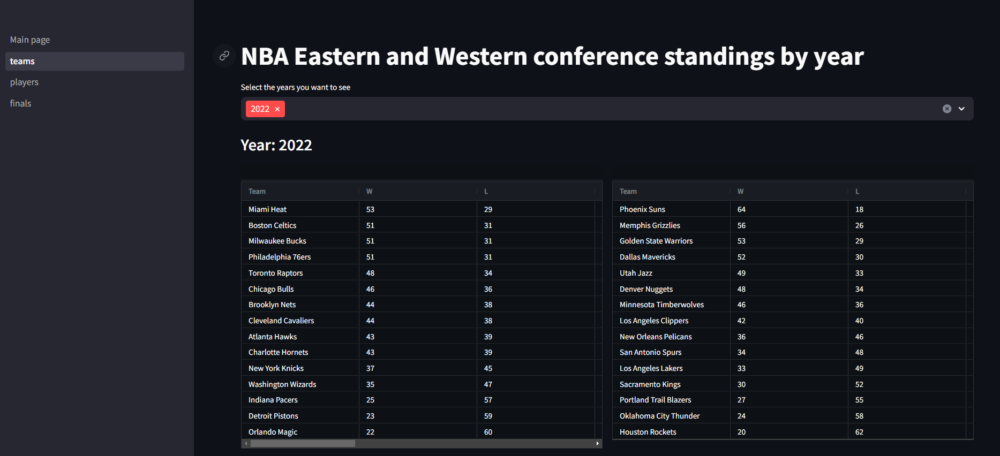
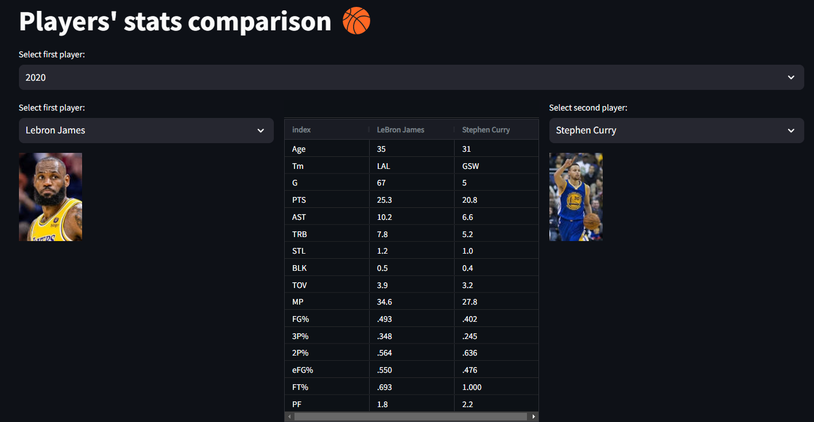
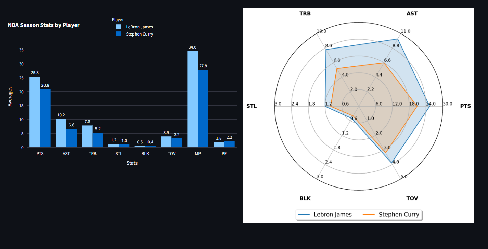
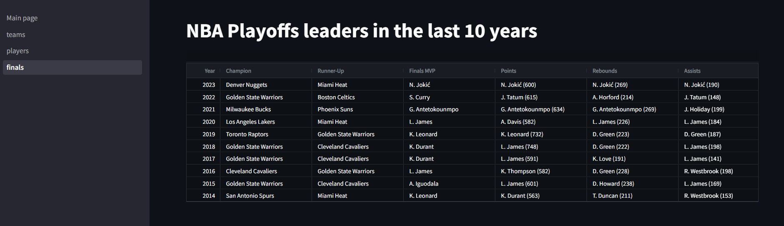

# NBA_Science
NBA modelling

## To run the app:

$ streamlit run app/Main_page.py

## Summary

- Main Page: summary of the dashboard
- teams: Western and Eastern Conference results by year
- players: 2 player comparison by year
- finals: playoffs stats over the last 10 years

## Overview

